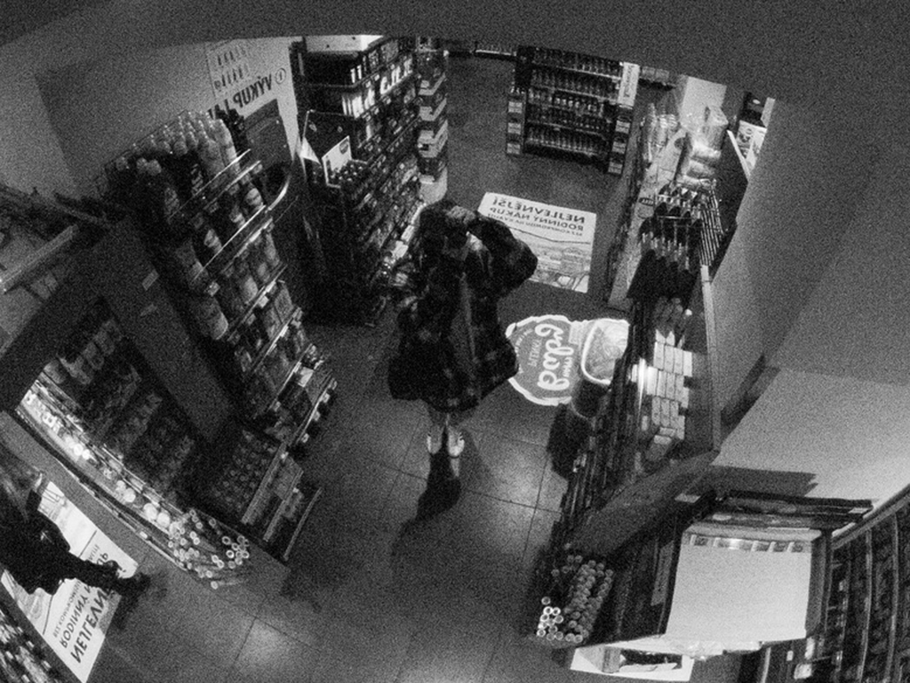

# Šimon Fibír

(Getting groceries)

### How I got into photography

I'm a visual creative person. Doesn't really matter what I do, I just need to create things. From drawing, animating, designing, sewing to my favourite activity, photographing. 

I started taking pictures when i was 13 years old with my moms digital camera that dad gave her for her birthday. I used to borrow it all the time and then went out to the wild to capture some action. Almost ten years later I still have her camera and chances are that when you bump into me, I have it around my neck or in my backpack. But my moms camera wasn't the reason I got really into photography. 

It was when my dad gave me his old analogue camera for my 16th birthday. The thrill and worry I have when I take a picture on my analogue camera fills me with joy. I really enjoy the aspect of not seeing immediately your pictures after you took them. And then when you develop them, It's like I was a little kid again and my mum gave me Kinder surprise. My love and passion for photography then skyrocketed which led me here, to VŠKK.

### Why photography?

There are hundreds of millions of pictures taken every day on our phones, cameras, CCTV, photo booths, computers, etc. With so many people having cameras with the lens the size of their pinkie nails, everyone takes pictures nowadays. It's just so accesible. And even the most recent phones have cameras that outclass my 10 year old DLSR camera. So anyone can leap into photography and call themselves photographer. But are they?

Current trends also force photographers to build their portfolios on social media platforms such as Instagram, Facebook, LinkedIn and X. And a lot of them try and try to get a large following so they feel accomplished. But this results either dumping a lot of photographs without second thought or make their work so sanitized that it becomes a kitsch. I've followed a lot of photographers that did just that and from what I observed, the photographs were just aestchetically pleasing and lacked any meaning.

To me photography is not just the ability to make aestethically pleasing pictures. It's about telling stories. It's about sharing your ideas. It's about showing other people how you see the world without saying a word. Photograph is a fraction of time made to last. Photograph is a documentation of reality. Photographers don't have empty canvases, sketchbooks, files or papers. You work with what you see, what's in front of you.

Then you think about how you capture that moment. How you compose the picture. Which shutter, aperture and ISO? Color or black and white? Should I pose my subject somewhere else or this is fine? Once I make this decision I take the picture. I don't really wave around my camera aimlessly with my index finger glued to my shutter. I don't sort through thousands and thousands of photos to find just one thats good. For me it has to be the right moment, the right composition, the right setting with the right light and boom. Magic.

(This is a picture i took of my partner when we were in a botanical garden to see a butterfly exhibition. She loves butterflies and she didn't know i was taking this picture until she heard my shutter. This photo means so much to me, because it's a photo of my partner, the lighting is perfect and even though she isn't smiling on the photo, I can definetly feel that she's happy.)

[⇤Back](https://simxn01.github.io/english-for-designers/)
