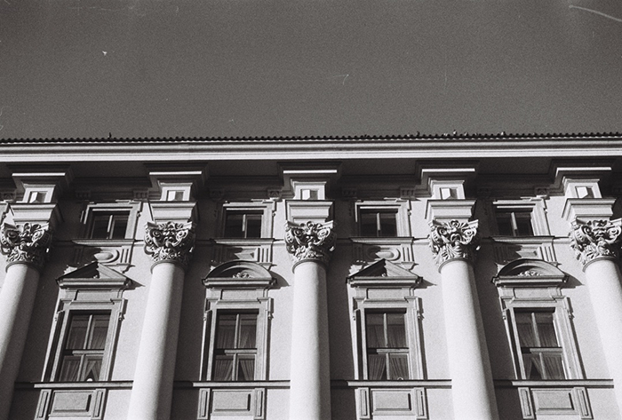

# My professional experience and private projects
## Professional experience
- [Ultravagant](https://www.instagram.com/ultravagant)

  Ultravagant is a very young fashion brand that aims to shine a new light to clothing sustainability and upcycling. Their main emphasis is to "Be yourself", to ushackle yourself from societal norms and trends and wear whatever you want to wear. Ultravagant wants to bring some new spice in czech clothing industry in high-end fashion, as well as normal day to day clothing. But clothing isn't the only thing they do. Their studio is also a "Culture spot", where they stage events such as slam poetry, various art expositions (Photography, sculptures, paintings, etc.), music concerts and fashion shows. So not only they contribute to diversification of clothing industry, they also support cultural or art movements and educates themselves and those around them.

  I've had the opportunity to work for Ultravagant two years ago. First as an intern helping everyone in marketing team but as the time went I became the head of video production. Long YouTube videos and sometimes the short-form videos that were published on social media. And in my free time I still helped to document events and photograph clothing sewn by UltraVagant to be put on the online shop.

(This photo was taken when UltraVagant were making a set of clothes on czech sacred mountain Říp as a commemoration to our great ancestors. We brought the sewing machine ourselves and spent the whole day sewing and capturing the creative process.)

(Example of some product photography i did for UltraVagant.)

(Another example.)

(Another example.)

- [Peče celá země (Česká Televize)](https://www.ceskatelevize.cz/porady/12309875102-pece-cela-zeme/)

(Moderators and judges of the show "Peče celá země")

This year I was given the opportunity to work in national "Czech television" as a external cameraman in a competitive reality show "Whole nation bakes". The show consists of ten contestants and four judges and as any competitive cooking show, contestants have to bake a specific recipe chosen by the judges in a limited amount of time and the judges then decide which contestant made the best and the worst dish/dessert. At the end of every episode the least succesful contestant will be eliminated from the show. The last contestant standing wins.

Working in this professional environment taught me lot about television production, scheduling, working under pressure and equipment used in professional sets. Being behind the scenes in a show produced by national television was always something exciting for me, to see how it's made, so I'm really grateful for this opportunity. It was my first experience working for ČT and I hope it's not going to be the last one. (Currently enrolling into inetrnship at ČT so fingers-crossed.)

## Personal work

- Geometric Architecture

  Since I first picked up camera when I was young, I was really intrigued by various shapes and surfaces in architecture. And me exceeding in math at high school really helped, especially geometry. So always when I'm out on a photographic walk I look up on the buildings around me and look for interesting shapes, curves and surfaces as well as how light interacts with them. This is my personal collection of photographs I took over the years of architecture. It's far from complete but it's beginning  to take shape (haha) which I like.

  

(This photograph was taken recently in my hometown Hradec Králové during my walks. It's a hotel close to the train station built by the previous regime. It's scheduled to be demolished in the near future.)

  

  (I took this photograph when I was visiting Berlin. It seemed to be ready for demolition as well, but I wanted capture it before it was gone, because I liked how uniform and geometric it looked.)
  
  

  (I took this photograph during a workshop when we were learning how to develop film. I like this one, because of the repeating patterns. Even the courtains are the same.)
  
  

  (This is a photograph from the first film roll that i exposed. It will always stay in my heart, because it sparked my love for photography.)
  
  

  (Another photograph I took recently in my hometown during my walks. It baffled me how much weigh these wires had to hold to keep this concrete cylinder still.)
  

[⇤Back](https://simxn01.github.io/english-for-designers/)
